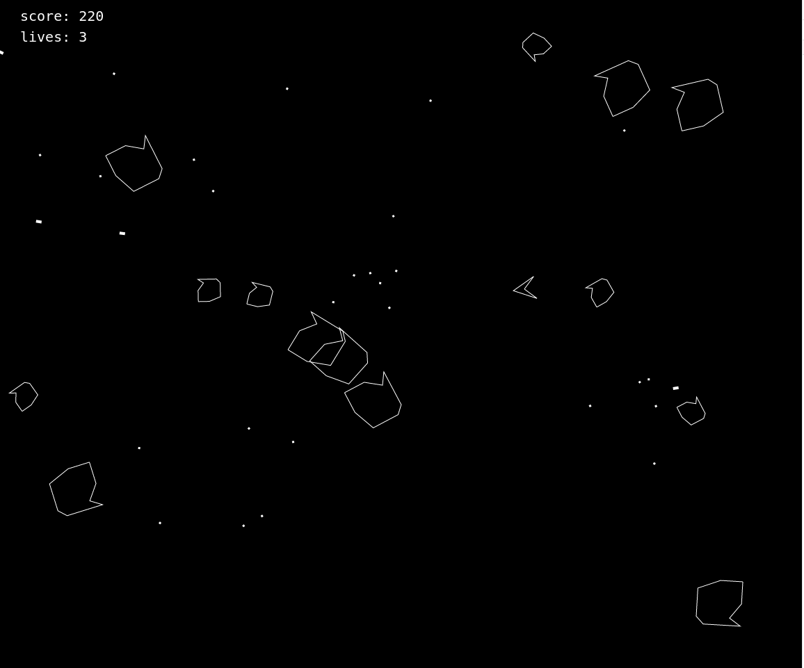

# Asteroids

This is my clone of old Atari game with the same name. It's written entirely in `TypeScript` with use of [arrow-js](https://www.arrow-js.com/#watching-data)

	

		Game picture
	

	

## Starting the application

As for now the game needs to be it is advised to first make current bundle of the game via webpack script inside of `package.json` and then serve it with live-server or tiny `http / express` server.

### Installing dependencies

The game is written in `TypeScript` and `Sass` to make my work more enjoyable. With that in mind you can be sure, that you need to install dependencies first and then transpiled all source into regular `.js & .css` files.

Scripts bellow not only installs dependencies, but also builds current source and serves it with `Express.js`. The `server.js` file takes port either from argument or environmental variable. (If none of these were filled, then it will defaults to 3000)

**npm:** `npm install && npm run build && node ./server.js`

**yarn:** `yarn && yarn run build && node ./server.js`

## Issue tracker

1. The game is not finished. It's still missing: engine animation, aliens, sfx, implement scenes for high score.

2. Current collision system is pathetic. I mean it get's the job done, but I guess there must be a better way.

3. I didn't really had time to properly test everything, so there must be a plenty of bugs and other various problems.
