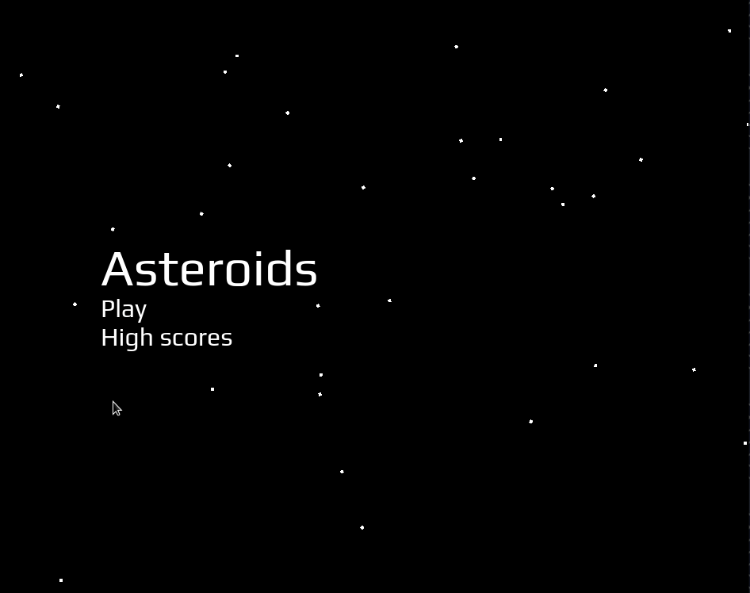

# Asteroids

This is my clone of old Atari game with the same name. It's written entirely in `TypeScript` with use of [arrow-js](https://www.arrow-js.com/#watching-data) for making a reactive UI.

	

		Game picture
	

	

## Starting the application

To actually start the project for yourself you have to first make a current release of the game via webpack script inside of `package.json` and then serve it with live-server or tiny `http / express` server.

### GitHub pages

I have also allowed github pages, so you can visit it via link in side menu.

### Installing dependencies

The game is written in `TypeScript` and `Sass` to make my work more enjoyable. With that in mind, you can be sure, that you need to install dependencies first and then transpile all source code into regular `.js`, `.css` files.

I provide `npm/yarn` scripts bellow, that not only install dependencies, but also transpile current source and serve it with `server.js`. The `server.js` file takes port either from argument, environmental variable or it takes a 3000 as fallback.

**npm:** `npm install && npm run build && node ./server.js`

**yarn:** `yarn && yarn run build && node ./server.js`

## Contributions & forks

Feel free to fork or help me with this project.

## Issue tracker

1. The game is not finished. It's still missing: Player's animations, aliens, sfx, implement view for high score.

2. Current collision system is pathetic. I mean it get's the job done, but I guess there must be a better way.

3. I didn't really have time to properly test everything, so there must be a plenty of bugs and other various problems.
